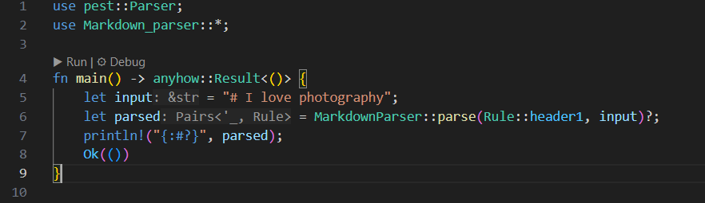

## markdown Parser
парсер буде обробляти синтаксис Markdown, а саме заголовки трьох рівнів, жирний шрифт, курсив, нумеровані і ненумеровані списки, цитати, код, лінки, зображення та горизонтальні лінії. це все і буде парситись, передаючись до структури MarkdownParser. до тексту будуть застосовуватись правила граматики. результат буде виводитись в кнсоль якщо знайдеться елемент синтаксису.


## code example
```rust
    use pest::Parser;
    use Markdown_parser::*;

    fn main() -> anyhow::Result<()> {
        let input = "# I love photography";
        let parsed = MarkdownParser::parse(Rule::header1, input)?;
        println!("{:#?}", parsed);
        Ok(())
    }
```

